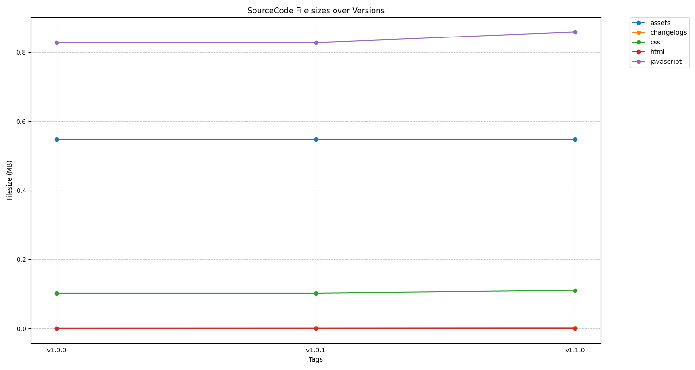

# Project Statistics

## SourceCode Assets

| Asset | **v1.0.0** | **v1.0.1** | **v1.1.0** |
| --- | --- | --- | --- |
| assets | 548.09 KB | 548.09 KB | 548.09 KB |
| changelogs | 507.00 B | 830.00 B | 1.58 KB |
| css | 101.98 KB | 101.98 KB | 110.34 KB |
| html | 577.00 B | 577.00 B | 577.00 B |
| javascript | 828.08 KB | 828.24 KB | 858.42 KB |

## x86_64 Assets

| Asset | **v1.0.0** | **v1.0.1** | **v1.1.0** |
| --- | --- | --- | --- |
| x86_64.app.tar.gz | - | 9.09 MB | 9.02 MB |
| x86_64.dmg | - | 8.95 MB | 8.88 MB |
| x86_64.exe | 5.70 MB | 5.70 MB | 5.71 MB |
| x86_64.msi | 8.25 MB | 8.25 MB | 8.19 MB |
| x86_64.rpm | 10.32 MB | 10.32 MB | 10.29 MB |

## amd64 Assets

| Asset | **v1.0.0** | **v1.0.1** | **v1.1.0** |
| --- | --- | --- | --- |
| amd64.AppImage | 82.40 MB | 82.39 MB | 82.35 MB |
| amd64.deb | 10.32 MB | 10.32 MB | 10.29 MB |

## aarch64 Assets

| Asset | **v1.0.0** | **v1.0.1** | **v1.1.0** |
| --- | --- | --- | --- |
| aarch64.app.tar.gz | 8.84 MB | 8.83 MB | 8.80 MB |
| aarch64.dmg | 8.64 MB | 8.63 MB | 8.59 MB |

## Total Comparison

| Asset | **v1.0.0** | **v1.0.1** | **v1.1.0** |
| --- | --- | --- | --- |
| aarch64.app.tar.gz | 8.84 MB | 8.83 MB | 8.80 MB |
| aarch64.dmg | 8.64 MB | 8.63 MB | 8.59 MB |
| amd64.AppImage | 82.40 MB | 82.39 MB | 82.35 MB |
| amd64.deb | 10.32 MB | 10.32 MB | 10.29 MB |
| assets | 548.09 KB | 548.09 KB | 548.09 KB |
| changelogs | 507.00 B | 830.00 B | 1.58 KB |
| css | 101.98 KB | 101.98 KB | 110.34 KB |
| html | 577.00 B | 577.00 B | 577.00 B |
| javascript | 828.08 KB | 828.24 KB | 858.42 KB |
| x86_64.app.tar.gz | - | 9.09 MB | 9.02 MB |
| x86_64.dmg | - | 8.95 MB | 8.88 MB |
| x86_64.exe | 5.70 MB | 5.70 MB | 5.71 MB |
| x86_64.msi | 8.25 MB | 8.25 MB | 8.19 MB |
| x86_64.rpm | 10.32 MB | 10.32 MB | 10.29 MB |
