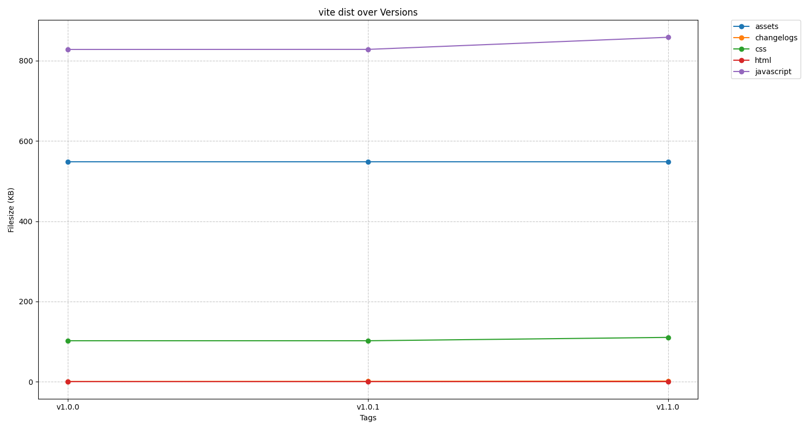
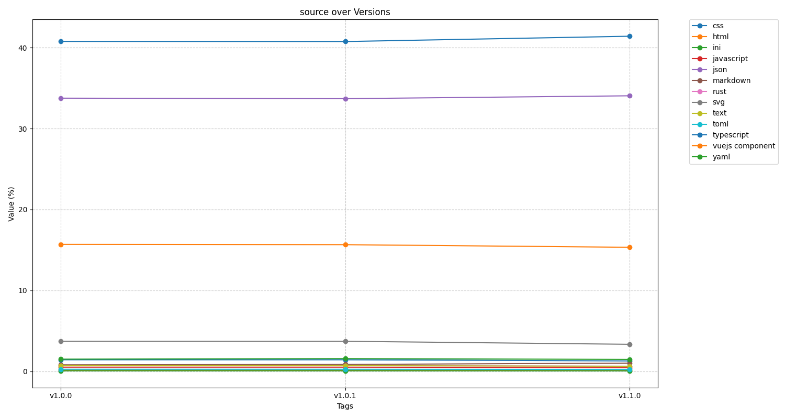
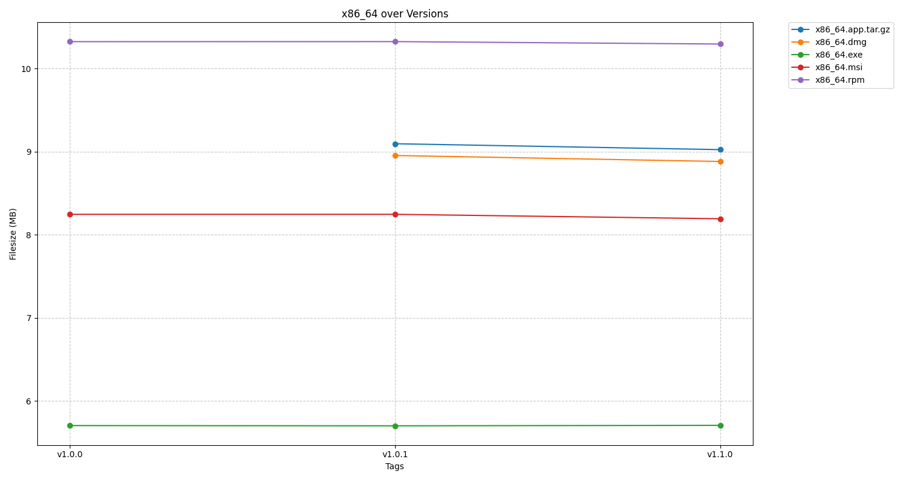
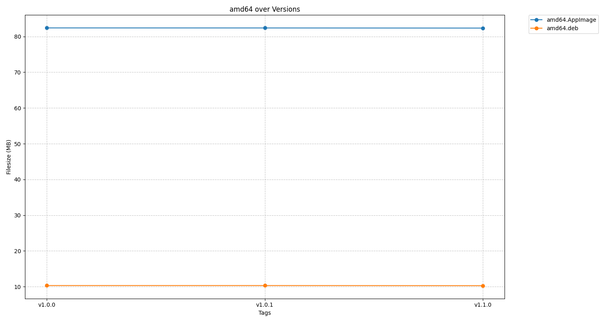
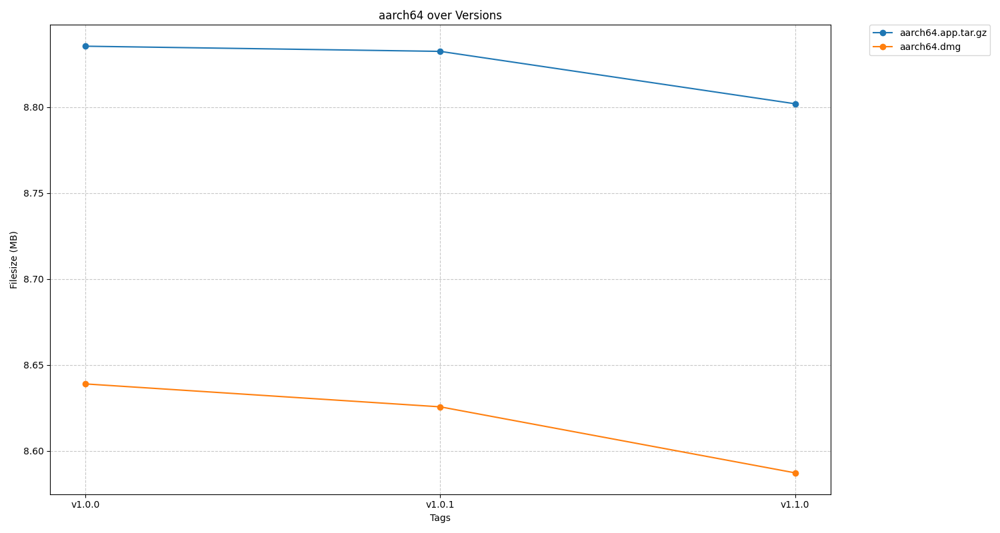

# Project Statistics

## vite dist Assets

| Asset | **v1.0.0** | **v1.0.1** | **v1.1.0** |
| --- | --- | --- | --- |
| assets | 548.09 KB | 548.09 KB | 548.09 KB |
| changelogs | 507.00 B | 830.00 B | 1.58 KB |
| css | 101.98 KB | 101.98 KB | 110.34 KB |
| html | 577.00 B | 577.00 B | 577.00 B |
| javascript | 828.08 KB | 828.24 KB | 858.42 KB |

## source Assets

| Asset | **v1.0.0** | **v1.0.1** | **v1.1.0** |
| --- | --- | --- | --- |
| css | 1.42% | 1.42% | 1.28% |
| html | 0.14% | 0.14% | 0.13% |
| ini | 0.06% | 0.06% | 0.06% |
| javascript | 0.51% | 0.50% | 0.45% |
| json | 33.77% | 33.70% | 34.06% |
| markdown | 0.79% | 0.84% | 1.01% |
| rust | 0.69% | 0.69% | 0.62% |
| svg | 3.71% | 3.71% | 3.33% |
| text | 0.69% | 0.69% | 0.62% |
| toml | 0.25% | 0.25% | 0.22% |
| typescript | 40.78% | 40.77% | 41.42% |
| vuejs component | 15.68% | 15.65% | 15.33% |
| yaml | 1.50% | 1.57% | 1.46% |

## x86_64 Assets

| Asset | **v1.0.0** | **v1.0.1** | **v1.1.0** |
| --- | --- | --- | --- |
| x86_64.app.tar.gz | - | 9.09 MB | 9.02 MB |
| x86_64.dmg | - | 8.95 MB | 8.88 MB |
| x86_64.exe | 5.70 MB | 5.70 MB | 5.71 MB |
| x86_64.msi | 8.25 MB | 8.25 MB | 8.19 MB |
| x86_64.rpm | 10.32 MB | 10.32 MB | 10.29 MB |

## amd64 Assets

| Asset | **v1.0.0** | **v1.0.1** | **v1.1.0** |
| --- | --- | --- | --- |
| amd64.AppImage | 82.40 MB | 82.39 MB | 82.35 MB |
| amd64.deb | 10.32 MB | 10.32 MB | 10.29 MB |

## aarch64 Assets

| Asset | **v1.0.0** | **v1.0.1** | **v1.1.0** |
| --- | --- | --- | --- |
| aarch64.app.tar.gz | 8.84 MB | 8.83 MB | 8.80 MB |
| aarch64.dmg | 8.64 MB | 8.63 MB | 8.59 MB |

## Total Comparison

| Group | Asset | **v1.0.0** | **v1.0.1** | **v1.1.0** |
| --- | --- | --- | --- | --- |
| **vite dist** | assets | 548.09 KB | 548.09 KB | 548.09 KB |
|  | changelogs | 507.00 B | 830.00 B | 1.58 KB |
|  | css | 101.98 KB | 101.98 KB | 110.34 KB |
|  | html | 577.00 B | 577.00 B | 577.00 B |
|  | javascript | 828.08 KB | 828.24 KB | 858.42 KB |
| **source** | css | 1.42% | 1.42% | 1.28% |
|  | html | 0.14% | 0.14% | 0.13% |
|  | ini | 0.06% | 0.06% | 0.06% |
|  | javascript | 0.51% | 0.50% | 0.45% |
|  | json | 33.77% | 33.70% | 34.06% |
|  | markdown | 0.79% | 0.84% | 1.01% |
|  | rust | 0.69% | 0.69% | 0.62% |
|  | svg | 3.71% | 3.71% | 3.33% |
|  | text | 0.69% | 0.69% | 0.62% |
|  | toml | 0.25% | 0.25% | 0.22% |
|  | typescript | 40.78% | 40.77% | 41.42% |
|  | vuejs component | 15.68% | 15.65% | 15.33% |
|  | yaml | 1.50% | 1.57% | 1.46% |
| **x86_64** | x86_64.app.tar.gz | - | 9.09 MB | 9.02 MB |
|  | x86_64.dmg | - | 8.95 MB | 8.88 MB |
|  | x86_64.exe | 5.70 MB | 5.70 MB | 5.71 MB |
|  | x86_64.msi | 8.25 MB | 8.25 MB | 8.19 MB |
|  | x86_64.rpm | 10.32 MB | 10.32 MB | 10.29 MB |
| **amd64** | amd64.AppImage | 82.40 MB | 82.39 MB | 82.35 MB |
|  | amd64.deb | 10.32 MB | 10.32 MB | 10.29 MB |
| **aarch64** | aarch64.app.tar.gz | 8.84 MB | 8.83 MB | 8.80 MB |
|  | aarch64.dmg | 8.64 MB | 8.63 MB | 8.59 MB |
